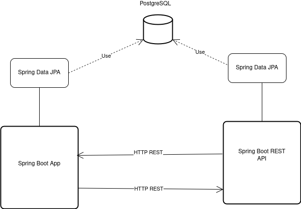

# Architecture

## Overview

The app uses 3-tier architecture with domain-based packaging. Each domain (`customer`, `employee`, `menu`, `reservation`, etc.) contains its own model, repository, and service. Controllers and DTOs live in a shared `web` package.

---

## Layers

**Presentation** — Spring MVC controllers return Thymeleaf views. `PUT` requests from forms use Spring's `HiddenHttpMethodFilter`.

**Business logic** — Service classes per domain. Cross-domain calls go through service interfaces, never directly between repositories.

**Persistence** — Spring Data JPA with Hibernate over PostgreSQL. Schema is managed via `ddl-auto: update`. Tests use an H2 in-memory database configured in `src/test/resources/application.yaml`.

**Security** — Spring Security 6 sits in front of the controller layer, handling session management, authentication, and role-based access. See [security docs](../security/security.md).

---

## External communication

The order-service ([repository](https://github.com/knetsov91/order-service-java-spring)) is a separate Spring Boot app running at `http://localhost:8081`. Communication is synchronous HTTP via OpenFeign (`OrderClient`). `OrderScheduler` also polls the order-service periodically using `@Scheduled`.

---

## Deployment

The app is containerized using a multi-stage Docker build on Java 17. The first stage builds the fat JAR with Gradle; the second stage runs it. `docker-compose.yaml` sets up the PostgreSQL container with a persistent volume.
