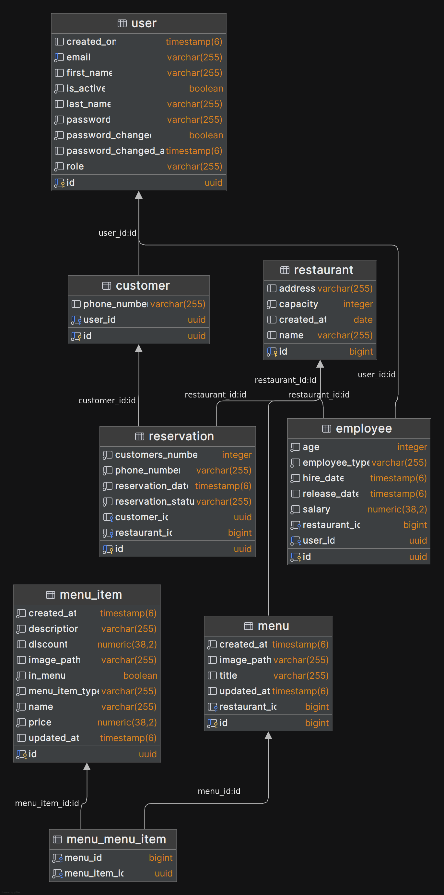

# Database

PostgreSQL is used for persistence. Credentials are supplied via `POSTGRES_USER` and `POSTGRES_PASSWORD` environment variables. Spring Data JPA with Hibernate manages the schema using `ddl-auto: update`.

## ER Diagram

## Tables

- **user** — stores authentication and profile data for all users
- **customer** — references `user` one-to-one, holds reservation-related data; created automatically on registration
- **employee** — references `user` one-to-one, holds employment data; references a specific restaurant
- **restaurant** — stores restaurant information; other entities reference it to associate their data
- **reservation** — references a restaurant; `customer_id` is nullable to support guest reservations
- **menu** — references a restaurant, groups menu items
- **menu_item** — catalogue of items shared across menus
- **menu_menu_item** — join table for the many-to-many between `menu` and `menu_item`
