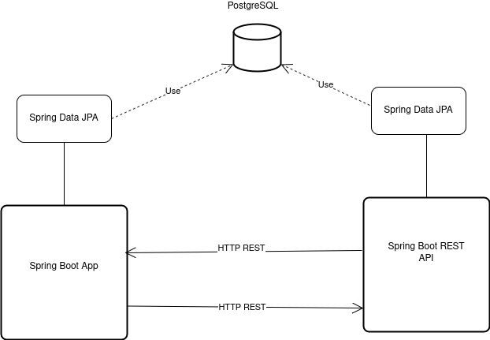

<h1>Architecture documentation</h1>
<h2>Overview</h2>

Project is implemented using 3-tier architecture. Presentational layer consists of controllers 
that returns views using Thymeleaf template engine. Bussiness logic is organized in service methods.
In persistence layer for interaction with PostgreSQL RDBMS, Hibernate ORM is used via Spring Data JPA.
Communication with Order service(<a href="https://github.com/knetsov91/order-service-java-spring">link</a>) is synchronous via HTTP using Feign Client.

