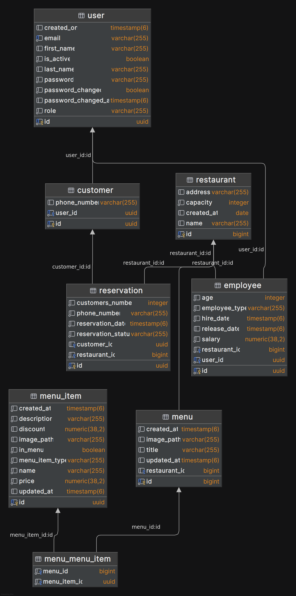

<h1 style="text-align: center">Database documentation</h1>
<h2>Overview</h2>

PostgreSQL RDBMS is used for data persistence. Database configurations are stored in environment variables for safety reaseons.
Spring Data with Hibernate ORM is used for interaction with database. 

<h2>ER Diagram</h2>
